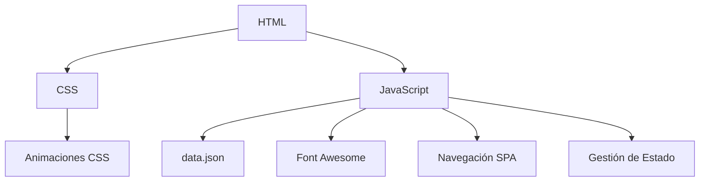
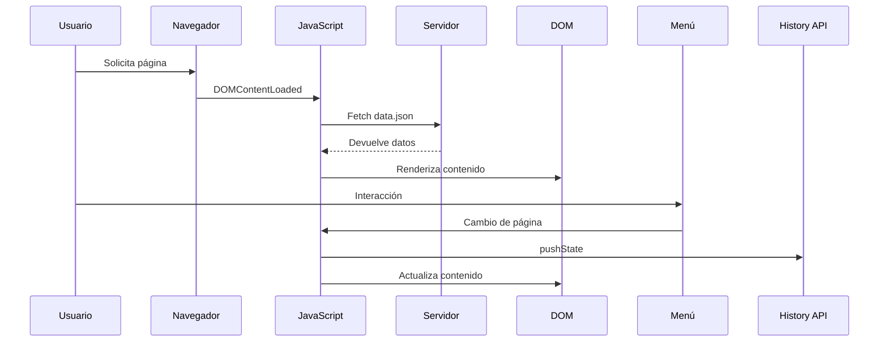

# WikiTek - Documentación Técnica

## Descripción General
WikiTek es una plataforma web interactiva diseñada para preservar y mostrar información sobre la primera generación de estudiantes del Tecnológico de Software. Funciona como un repositorio digital que combina elementos de una wiki tradicional con características modernas de una Single Page Application (SPA). El sitio permite a los usuarios explorar perfiles de estudiantes, maestros y otros miembros de la comunidad, además de ofrecer información relevante sobre la institución.

---

## Arquitectura del Sistema


---

## Stack Tecnológico
| Componente            | Tecnologías Usadas                           |
|-----------------------|---------------------------------------------|
| **Frontend**         | HTML5, CSS3, Vanilla JavaScript (ES6+)      |
| **Diseño**           | CSS Grid, Flexbox, Animaciones CSS          |
| **Iconos**           | Font Awesome 6.4.0                          |
| **Gestión de Estado**| Patrón MVC Light                           |
| **Hosting**          | Compatible con GitHub Pages/Netlify         |

---

## Estructura de Archivos
```
wikitek/
├── index.html          # Punto de entrada principal
├── styles.css          # Todos los estilos CSS
├── scripts.js          # Lógica principal de la aplicación
├── data.json           # Base de datos de perfiles
└── img/                # Assets visuales
    ├── perfiles/       # Fotos de estudiantes
    └── fondos/         # Imágenes de fondo
```

---

## Componentes Clave

### 4.1 Sistema de Navegación (SPA-like)
```javascript
const navigationSystem = {
  currentPage: 'inicio',
  profilePages: ['gerardo', 'yuri', 'miguel', 'nuevo-personaje'],
  functions: {
    navigateToPage: 'Carga dinámica de contenido',
    handlePopState: 'Gestión del historial del navegador',
    updateButtonStates: 'Control de botones Anterior/Siguiente'
  }
};
```

### 4.2 Generadores de Contenido
```javascript
// Plantilla para página de inicio
const homeTemplate = (data) => `
  <div class="hero-section">
    <h1>${data.heading}</h1>
    ${data.features.map(createFeatureCard).join('')}
  </div>
`;

// Plantilla para perfiles
const profileTemplate = (data) => `
  <section class="profile-content">
    
    <div class="profile-info">
      ${data.info_adicional.map(createInfoCard).join('')}
    </div>
  </section>
`;
```

### 4.3 Sistema de Estilos Avanzados
```css
/* Ejemplo de diseño de tarjeta con efectos */
.feature-card {
  background: rgba(27, 38, 59, 0.7);
  backdrop-filter: blur(5px);
  border-radius: 12px;
  transition: all 0.4s ease;
  animation: cardAppear 0.8s cubic-bezier(0.175, 0.885, 0.32, 1.275);
}

/* Sistema de animaciones */
@keyframes iconFloat {
  0%, 100% { transform: translateY(0) rotate(0); }
  50% { transform: translateY(-5px) rotate(5deg); }
}
```

---

## Flujo de Datos Principal


---

## Guía de Desarrollo
### 6.1 Requisitos
- Navegador moderno (Chrome 90+, Firefox 88+)
- Servidor web local (Live Server recomendado)
- Editor de código (VS Code, Sublime Text)

### 6.2 Estructura de Datos
```json
{
  "pages": [
    {
      "id": "ejemplo",
      "title": "Título Página",
      "background": "ruta/imagen.jpg",
      "content": {
        "heading": "Encabezado",
        "description": "Texto descriptivo",
        "info_adicional": [
          {
            "titulo": "Sección",
            "contenido": "Detalles",
            "icono": "fa-icono"
          }
        ]
      }
    }
  ]
}
```

---

## Roadmap de Desarrollo
| Versión | Objetivo                     | Prioridad |
|---------|------------------------------|----------|
| **2.1** | Sistema de búsqueda          | Alta     |
| **2.2** | Autenticación de usuarios   | Media    |
| **3.0** | Panel de administración CMS | Baja     |

---

## Solución de Problemas Comunes
| Error                     | Causa Probable                     | Solución                       |
|---------------------------|-----------------------------------|---------------------------------|
| Contenido no carga        | Rutas incorrectas en data.json   | Verificar rutas de imágenes    |
| Menú no se despliega     | Conflictos de z-index            | Aumentar z-index del menú      |
| Animaciones no funcionan  | Navegador no compatible          | Usar prefijos -webkit-         |
| Botones de navegación ocultos | Página no en profilePages    | Añadir ID a profilePages       |

---

## Ejemplo de Uso
1. El usuario ingresa a la página principal.
2. Explora las características destacadas.
3. Navega a la sección de alumnos.
4. Selecciona un perfil específico.
5. Interactúa con la información detallada.
6. Usa los botones de navegación para ver otros perfiles.
7. Regresa al inicio usando el menú principal.

